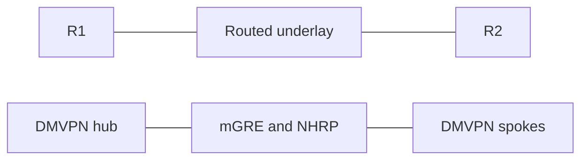

# IPsec and DMVPN


Cisco IOS configurations for IKEv1, IKEv2, IPsec and DMVPN Phase 3.

> [!WARNING]
> Use these configurations only in an isolated, authorized router topology.

## What it covers

- IKEv1 with AH authentication and ESP protection.
- IKEv1 with RSA authentication, SCEP enrollment and ESP protection.
- IKEv2 with pre-shared-key authentication and IPsec profiles.
- mGRE, NHRP, redirect and shortcut behaviour for DMVPN Phase 3.

## Topology



See [docs/ARCHITECTURE.md](docs/ARCHITECTURE.md) for addressing, routing and tunnel behaviour.

## Layout

```text
configs/     Cisco IOS configuration templates and static configurations
scripts/     configuration template rendering helpers
docs/        topology and protocol notes
evidence/    selected router and packet summaries
```

## Requirements

- GNS3 with Cisco IOS nodes that support the selected IKE and IPsec features.
- Routed underlay reachability between tunnel endpoints.
- A CA/SCEP service when using the RSA template.

## Quick start

The DMVPN hub configuration is ready to load. Render the IKEv2 peers with a local pre-shared key:

```bash
IPSEC_PSK=... python3 scripts/render_config.py configs/ikev2-r1.cfg.template r1.cfg
IPSEC_PSK=... python3 scripts/render_config.py configs/ikev2-r2.cfg.template r2.cfg

```

`ikev1-ah.cfg.template` also requires `PEER_ADDRESS` and `LAN_INTERFACE`. The RSA template additionally requires `SCEP_URL` and `ROUTER_NAME`. The spoke template requires `TUNNEL_ADDRESS`.

## Verification

- Generate protected traffic and check IKE and IPsec SA state on both peers.
- Confirm IPsec packet encapsulation and decapsulation counters increase.
- Register two spokes with the hub, then generate spoke-to-spoke traffic and verify NHRP shortcut state.

## Safety

Do not commit keys, certificates, router images, VM disks, captures or local GNS3 project files. See [SECURITY.md](SECURITY.md).
