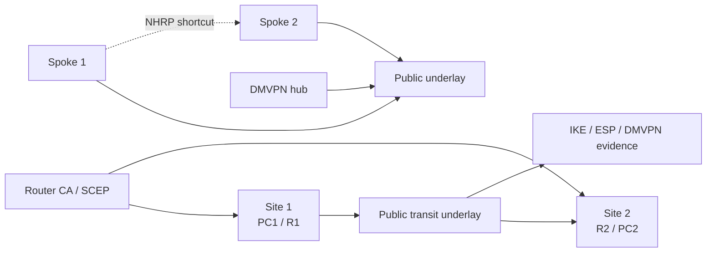

# IPSec and DMVPN Security Lab

A reproducible Cisco/GNS3 security lab for IPSec with IKEv1/IKEv2, certificate-based authentication, SA rekeying, and DMVPN Phase 3 spoke-to-spoke shortcuts.

[](https://www.gns3.com/)
[](#academic-context)

[!WARNING]
This repository documents controlled academic network-security lab work. Run the commands and scenarios only in isolated environments where you have authorization. Licensed appliance images, course handouts, raw packet captures, and local lab state are intentionally excluded.

## Overview

This repository packages the SAAR Lab 2.1 IPSec and DMVPN work as a publishable network-security project. It compares AH and ESP behavior, explores pre-shared keys and RSA-signature authentication, validates IKEv2 rekeying, and demonstrates DMVPN Phase 3 shortcut forwarding.

The repository is organized for public review: report source, architecture notes, selected evidence, CI-safe validation, and publication hygiene files are kept separate from generated or restricted lab artefacts.

## Academic Context

SAAR / Advanced Network Security and Architectures at Instituto Superior Tecnico. The lab focuses on VPN protocol behavior, packet-capture interpretation, PKI-backed router authentication, and dynamic multipoint overlay routing.

## Key Features

- IKEv1 with pre-shared keys, AH, ESP, and Wireshark comparison.
- IKEv1 with RSA signatures, SCEP enrollment, CA validation, and certificate revocation impact.
- IKEv2 proposal, policy, profile, SA validation, and ESP-protected traffic.
- IKE SA and Child SA rekeying behavior with CREATE_CHILD_SA interpretation.
- DMVPN Phase 3 hub/spoke registration, NHRP redirects, shortcuts, and routing behavior.

## Architecture



See [docs/ARCHITECTURE.md](docs/ARCHITECTURE.md) for system boundaries, evidence flow, and publication caveats.

## Tech Stack

- GNS3
- Cisco IOS
- IPSec AH/ESP
- IKEv1 / IKEv2
- SCEP / PKI
- DMVPN Phase 3
- NHRP
- Wireshark
- PDF Report

## Repository Structure

```text
.
|-- docs/
|   |-- ARCHITECTURE.md
|   `-- report/
|-- evidence/
|-- scripts/
|-- CONTRIBUTING.md
|-- SECURITY.md
`-- README.md
```

- `docs/report/` - Final PDF report extract and selected figures.
- `docs/ARCHITECTURE.md` - Topology, evidence flow, and publication boundary.

## Getting Started

Clone the repository and run the portable publication checks:

```powershell
```

Full lab reproduction requires a local GNS3 environment with the corresponding Cisco/Linux appliances and the original lab topology. Those resources are not redistributed here.

## Evidence Policy

Evidence under `evidence/` is curated and text-based where possible. Raw captures (`.pcap`, `.pcapng`), VM images, IOS/ASAv images, GNS3 project IDs, large generated artefacts, and private course PDFs are not included. The report references course material instead of vendoring it.

## Security and Ethics

This is an authorized educational network-security project. Do not target third-party systems, production networks, or public infrastructure. See [SECURITY.md](SECURITY.md) for scope and reporting guidance.

## Limitations

- Full reproduction requires Cisco-compatible GNS3 routers and the original lab topology.
- Selected screenshot evidence is included; raw captures are excluded.
- The repository preserves the report and interpretation rather than shipping licensed lab images.

## Roadmap

- Add sanitized config snippets per router under a dedicated configs directory.
- Add local LaTeX build instructions for the standalone report.
- Add optional verification checklist for rerunning the tunnel tests.

## Usage Note

This repository is published as an academic portfolio and reproducibility artefact for SAAR laboratory work. Course guides, network appliance images, and third-party materials may be subject to separate terms.

## References

- [Instituto Superior Tecnico](https://tecnico.ulisboa.pt/)
- [GNS3](https://www.gns3.com/)
- [Wireshark](https://www.wireshark.org/)
- Project-specific lab guides and course slides are cited inside the report source.

## Topics

cybersecurity, network-security, ipsec, ikev1, ikev2, dmvpn, nhrp, pki, gns3, cisco, academic-project
